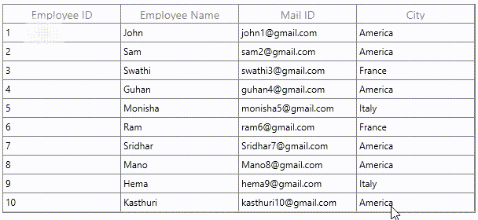

# How to Customize the Shift and Arrow Key Selection Behavior in WPF DataGrid?

This example illustrates how to customize the shift and arrow key selection behavior in [WPF DataGrid](https://www.syncfusion.com/wpf-controls/datagrid) (SfDataGrid).

The text is selected when press the Shift Left or Shift Right key in editor control of [WPF DataGrid](https://www.syncfusion.com/wpf-ui-controls/datagrid) (SfDataGrid). You can move the current cell in SfDataGrid when pressing Shift Left or Shift Right key by customized the `PreviewKeyDown` event in corresponding column renderer. For example [GridTextBoxColumn](https://help.syncfusion.com/cr/cref_files/wpf/Syncfusion.SfGrid.WPF~Syncfusion.UI.Xaml.Grid.GridTextColumn.html) customizing by using the [GridCellTextBoxRenderer](https://help.syncfusion.com/cr/wpf/Syncfusion.UI.Xaml.Grid.Cells.GridCellTextBoxRenderer.html). 

```C#
this.sfdatagrid.CellRenderers.Remove("TextBox");
this.sfdatagrid.CellRenderers.Add("TextBox", new GridCellTextBoxRendererExt(sfdatagrid));

public class GridCellTextBoxRendererExt : GridCellTextBoxRenderer
{
        public SfDataGrid grid;

        public GridCellTextBoxRendererExt(SfDataGrid sfDataGrid)
        {
            grid = sfDataGrid;
        }

        public override void OnInitializeEditElement(DataColumnBase dataColumn, TextBox uiElement, object dataContext)
        {
            base.OnInitializeEditElement(dataColumn, uiElement, dataContext);
            uiElement.PreviewKeyDown += UiElement_PreviewKeyDown;
        }

        private void UiElement_PreviewKeyDown(object sender, KeyEventArgs e)
        {
            if (Keyboard.IsKeyDown(Key.RightShift) || Keyboard.IsKeyDown(Key.LeftShift))
            {
                if (e.Key == Key.Right)
                {
                    grid.SelectionController.CurrentCellManager.EndEdit();
                    RowColumnIndex rowcol = new RowColumnIndex(this.grid.SelectionController.CurrentCellManager.CurrentRowColumnIndex.RowIndex, this.grid.SelectionController.CurrentCellManager.CurrentRowColumnIndex.ColumnIndex + 1);
                    grid.MoveCurrentCell(rowcol, false);
                }
                else if (e.Key == Key.Left)
                {
                    grid.SelectionController.CurrentCellManager.EndEdit();
                    RowColumnIndex rowcol = new RowColumnIndex(this.grid.SelectionController.CurrentCellManager.CurrentRowColumnIndex.RowIndex, this.grid.SelectionController.CurrentCellManager.CurrentRowColumnIndex.ColumnIndex - 1);
                    grid.MoveCurrentCell(rowcol, false);
                }
                e.Handled = true;
            }
        }
}

```

`DataGrid` provides support for various built-in column types. Each column has its own properties and renderer for more details please refer the below documentation link.

Take a moment to peruse the [WPF DataGrid - Column Types](https://help.syncfusion.com/wpf/datagrid/column-types) documentation, where you can find about DataGrid column types with code examples.


